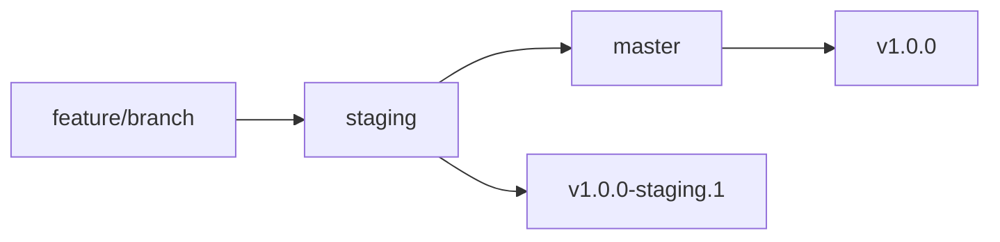

# Branch Protection Rules Setup

This document explains how to configure GitHub branch protection rules for optimal workflow with semantic-release.

## 🛡️ Recommended Branch Protection Rules

### **Master Branch Protection**

Navigate to: `Settings` → `Branches` → `Add rule` for `master`

#### Required Settings:
- ✅ **Require pull request reviews before merging**
  - Required approving reviews: `1`
  - ✅ Dismiss stale PR approvals when new commits are pushed
  - ✅ Require review from code owners (if CODEOWNERS exists)

- ✅ **Require status checks to pass before merging**
  - ✅ Require branches to be up to date before merging
  - Required status checks:
    - `Production Versioning / quality-gates`
    - `Production Versioning / release`

- ✅ **Require conversation resolution before merging**

- ✅ **Include administrators**

- ✅ **Allow force pushes** (for semantic-release automation)

- ✅ **Allow deletions** (disabled for protection)

### **Staging Branch Protection**

Navigate to: `Settings` → `Branches` → `Add rule` for `staging`

#### Required Settings:
- ✅ **Require pull request reviews before merging**
  - Required approving reviews: `1`

- ✅ **Require status checks to pass before merging**
  - ✅ Require branches to be up to date before merging
  - Required status checks:
    - `Staging Versioning / quality-gates`
    - `Staging Versioning / build-validation`
    - `Staging Versioning / create-staging-tag`

- ✅ **Include administrators**

- ✅ **Allow force pushes** (for semantic-release automation)

## 🔧 GitHub Actions Secrets Required

Ensure these secrets are configured in: `Settings` → `Secrets and variables` → `Actions`

### Required Secrets:
- `GITHUB_TOKEN` - Automatically provided by GitHub (no setup needed)

### Optional Secrets (if using external services):
- `NPM_TOKEN` - If publishing to npm registry
- `AWS_ACCESS_KEY_ID` - For AWS S3 deployment
- `AWS_SECRET_ACCESS_KEY` - For AWS S3 deployment
- `SLACK_WEBHOOK` - For Slack notifications

## 🚀 Workflow Configuration

The current setup ensures:

1. **No direct pushes** to `master` or `staging`
2. **All changes via Pull Requests**
3. **Automatic releases** triggered by merges
4. **Status checks** prevent broken releases
5. **Semantic-release** can push tags and updates

## 📋 Branch Strategy



### Development Flow:
1. **Feature development**: `feature/new-feature` → `staging`
2. **Staging testing**: Automatic prerelease created
3. **Production deployment**: `staging` → `master`
4. **Stable release**: Automatic production release

## ⚠️ Important Notes

### For Semantic-Release to Work:
- ✅ **Allow force pushes** must be enabled
- ✅ **GITHUB_TOKEN** needs write permissions
- ✅ Status checks must include all workflow jobs

### Commit Message Enforcement:
- Commitlint hook prevents invalid commit messages
- All commits must follow conventional format
- PRs with invalid commits will be blocked

## 🔍 Status Checks Explanation

### Required Checks:
- **`quality-gates`**: Code quality validation (build, lint, test)
- **`release`**: Semantic-release analysis and version determination
- **`build-validation`**: React build validation
- **`create-staging-tag`**: Staging tag creation

### Optional Checks:
- **Code coverage**: If coverage reporting is enabled
- **Security scans**: If security tools are integrated
- **Performance tests**: If performance testing is setup

## 🚨 Troubleshooting

### Common Issues:

1. **Semantic-release can't push**
   - Ensure "Allow force pushes" is enabled
   - Check GITHUB_TOKEN permissions

2. **Status checks failing**
   - Verify workflow names match exactly
   - Check all required jobs are included

3. **PRs blocked unexpectedly**
   - Review required status checks list
   - Ensure all workflows are running

### Quick Fix Commands:
```bash
# Check current protection rules
gh api repos/:owner/:repo/branches/master/protection

# Verify workflow status
gh run list --branch staging
```

## 📚 References

- [GitHub Branch Protection](https://docs.github.com/en/repositories/configuring-branches-and-merges-in-your-repository/defining-the-mergeability-of-pull-requests/managing-a-branch-protection-rule)
- [Semantic Release CI Configuration](https://semantic-release.gitbook.io/semantic-release/usage/ci-configuration)
- [GitHub Actions Permissions](https://docs.github.com/en/actions/security-guides/automatic-token-authentication)